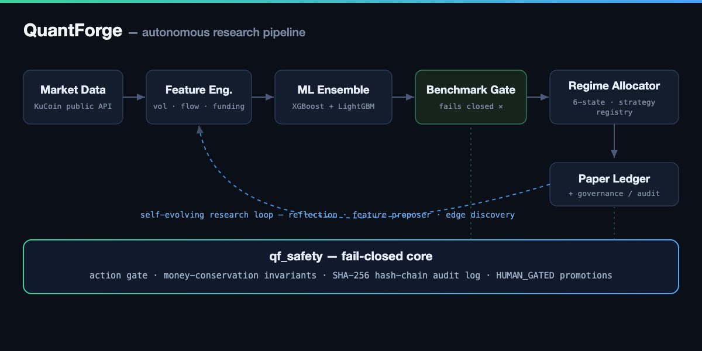
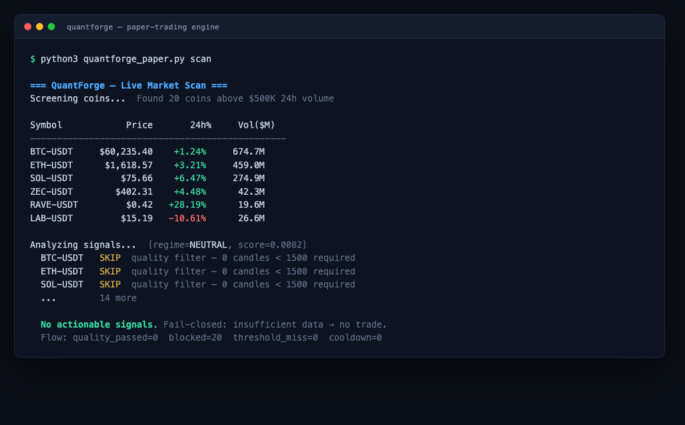

# QuantForge


**An autonomous crypto quant-research platform** — ML signal ensembles, regime-aware allocation, a funding-carry engine, a self-evolving research loop, and a fail-closed safety/MLOps stack. ~38,000 lines across 95 Python modules and 204 tests.

QuantForge runs the full loop end to end: it ingests market data, engineers features, trains and validates ML models with leak-free cross-validation, allocates capital across regime-aware strategies, and governs its own changes through a tamper-evident, human-gated safety layer — then proposes its next round of research and repeats.

<p align="center">
  
</p>

## See it run

A live market scan pulls real prices off KuCoin, classifies the regime, and runs every candidate through the quality filter — which **fails closed**: with no cached history it refuses to signal rather than guess.

<p align="center">
  
</p>

```bash
QF_ALLOW_LOCAL_RUNTIME=1 python3 scripts/quantforge_paper.py scan
```

---

## Highlights

**🤖 Machine-learning signal stack**
- XGBoost + LightGBM ensembles with walk-forward, strictly chronological cross-validation (`TimeSeriesSplit`).
- Per-symbol and target-profile model slicing; configurable forward-return horizons (1h/4h/24h).
- Feature engineering across technical, momentum, volatility, range, order-flow, and derivatives-state signals (funding rates, open interest, top-of-book, market breadth, macro).
- Specialist models + a benchmark gate a candidate must clear before it can be promoted.

**📊 Regime-aware allocation**
- A 6-state allocation-regime taxonomy (`STRONG_BULL → STRONG_BEAR`, in `quantforge_agent.py`) drives a pluggable strategy registry: trend/HODL, mean-reversion in chop, a leveraged futures lane, liquidation-dip, funding-carry, CVD momentum, volatility breakout, cross-asset, OI-divergence, and an ML scanner.
- A regime-weight table rebalances exposure as conditions shift; risk-adjusted position sizing with correlation penalties.

**🔁 Autonomous research loop**
- A self-reflection daemon reasons over realized performance and proposes parameter changes within safety bounds.
- A feature proposer self-engineers candidate signals and an edge-discovery cycle tests each one leak-free on real OHLCV.
- A research director orchestrates multi-slice campaigns; a self-evolution loop tunes the system — every change is gated, never auto-applied to live state.

**🛠️ MLOps + persistence (`qf_mlops`)**
- Model registry with atomic, content-addressed, versioned persistence (promotions are never silent).
- Carry backtester, edge-attribution, baselines, and benchmark gating.

**🔒 Fail-closed safety core (`qf_safety`)**
- Every gate rejects on uncertainty rather than silently passing — a missing key, an out-of-bounds number, or a missing file returns a non-zero exit.
- Tamper-evident **SHA-256 hash-chained decision log**; an action gate that classifies every action by risk level; money-conservation invariants; a candidate-promotion pipeline.
- A **config sentinel** AST-parses the live source and asserts the deployed policy bounds match the approved baseline — closing the "deployed ≠ live" gap at the code level.
- Every action is classified by a **risk-tiered permission model** (`PermissionLevel`: reversible-op → config-proposal → code/model-change → financial-security). Anything above routine reversible operations is blocked from autonomous execution and routed through `requires_human_approval` — it emits a proposal artifact and stops.

**✅ Engineering**
- 95 Python modules, **204 tests green on Python 3.10 / 3.11 / 3.12** (CI matrix).
- Leak-free evaluation: strictly chronological `TimeSeriesSplit`, labels computed as explicit forward-return shifts, look-ahead features excluded from training — and the ML gate fails closed when holdout metrics are missing or malformed (`tests/test_quantforge_ml_gate_truth.py`).
- A master verifier (`verify_quantforge.sh`) asserts the entire stack — docs, config sentinel, safety suite, sub-verifiers — and exits 0 only when the system is in a known-good, auditable state.

---

## Operating it with an LLM agent

QuantForge is built to be driven by an autonomous LLM agent — it runs in production under a personal agent ("Hermes") — and the integration is two simple, agent-agnostic contracts you can wire to **any** agent runtime (Claude Code, the Claude Agent SDK, or your own).

**1. Install the Agent Skill.** QuantForge ships an [Agent Skill](skills/quantforge/SKILL.md) in the standard `SKILL.md` format. Point your agent's skills directory at it:

```bash
# Claude Code / Agent SDK: skills are auto-discovered from the skills dir
cp -r skills/quantforge ~/.claude/skills/        # or your runtime's skills path
```

The skill teaches the agent the command surface, the two-layer config, and — critically — the **fail-closed permission model**: it heals operational issues autonomously, routes parameter changes through the proposal gate, sends code/model changes through the candidate pipeline, and **escalates anything touching risk limits, kill switches, real money, or credentials to a human.** The agent literally cannot do the dangerous things.

**2. Wire event-driven monitoring (optional).** On significant events (drawdown, regime flips, volatility spikes), QuantForge writes a small trigger file — an out-of-process agent polls it and runs deeper analysis only when there's something to look at (event-driven, not clock-driven). The path is set by `QF_ALERT_TRIGGER_FILE` (default `~/.quantforge/alert_trigger.json`):

```jsonc
// QF_ALERT_TRIGGER_FILE — written by QuantForge, consumed by your agent
{
  "ts": "2026-06-29T19:00:00+00:00",   // when it fired
  "reasons": ["BTC down 1.0% in 1h", "vol spike ATR=0.061"],
  "cooldown_h": 1.0,                     // adaptive: 0 on emergencies, up to 3h normally
  "consumed": false,                     // your agent sets true after handling
  "source": "quantforge_agent"
}
```

A minimal monitor loop in any agent: poll the file → if `consumed == false` and the timestamp is fresh, load the QuantForge skill, investigate (`quantforge_paper.py status`, `quantforge_governance.py`), act within the permission tiers, mark `consumed: true`. That is exactly how the reference Hermes agent drives it.

## Architecture

The pipeline diagram is at the top of this README. Module map:

```
scripts/
  quantforge_paper.py        Paper-trading engine: scan, signal, ledger
  quantforge_agent.py        Regime-aware allocator + pluggable strategy registry
  quantforge_ml.py           XGBoost + LightGBM ensemble, walk-forward CV
  quantforge_ml_train.py     Extended trainer: TimeSeriesSplit + target-profile slicing
  quantforge_features.py     Feature engineering pipeline
  quantforge_regime.py       Trend/volatility regime signal (BULL/BEAR/NEUTRAL + microstructure)
  quantforge_reflect.py      Self-reflection daemon — proposes param changes
  quantforge_research_director.py  Orchestrates multi-slice research campaigns
  quantforge_governance.py   Model/strategy health snapshots
  qf_mlops/                  Model registry, carry backtest, benchmark gate, edge attribution
  qf_safety/                 Fail-closed core: CAS store, decision log, action gate,
                             invariants, candidate pipeline, config schema
  config.py                  Env-driven config + runtime guard

docs/    System state, autonomous-loop protocol, evaluation verdict, roadmap
tests/   40 files, 204 tests — one per gate, invariant, and failure mode
```

---

## Quick start

```bash
git clone https://github.com/samueljai120/QuantForge.git
cd QuantForge
./setup.sh                                    # venv + deps + .env
python3 -m pytest tests/ -q                   # 204 tests
QF_ALLOW_LOCAL_RUNTIME=1 python3 scripts/quantforge_paper.py scan   # run a market scan
```

**Prerequisites:** Python 3.10+, pip. Market data uses KuCoin's public API (no key needed for read-only). An OpenRouter or Anthropic key enables the LLM-assisted reflection/research components. See `.env.example` for all configuration (everything is env-driven).

---

## Rigorous by design

Backtests lie. Most trading code overfits, leaks the future into the past, and ships a beautiful equity curve that evaporates the moment it goes live. QuantForge is engineered so that *can't* happen quietly:

- **Leak-free by construction** — strictly chronological `TimeSeriesSplit`; labels are explicit forward-return shifts and look-ahead features are excluded from training. The ML gate fails closed when holdout metrics are missing or malformed (proven by `tests/test_quantforge_ml_gate_truth.py`).
- **A multi-criteria benchmark gate** — a signal must clear out-of-sample AUC, calibration, net-of-cost Sharpe, edge-vs-cost margin, and stability across multiple time windows before it can be promoted. It fails closed.
- **Tamper-evident and human-gated** — every promotion and live-impacting change is recorded to a SHA-256 hash-chain and requires explicit approval; nothing mutates live state on its own.

Point it at a market, bring your own features and ideas, and QuantForge tells you — honestly, with the receipts — whether the edge is real *before* you risk a dollar. That discipline is the product. (Research notes from the bundled crypto study, including which strategies held up under cost, live in [`docs/QUANTFORGE_VERDICT.md`](docs/QUANTFORGE_VERDICT.md).)

> **Not financial advice.** This is a paper-trading and research system; it has never executed a real trade. Most cycle scripts refuse to run outside their configured host unless `QF_ALLOW_LOCAL_RUNTIME=1` is set.

---

## Repo layout

```
QuantForge/
  scripts/               67 modules — engine, ML, allocation, research, governance
  scripts/qf_mlops/      15 modules — MLOps (model registry, carry backtest, attribution)
  scripts/qf_safety/     13 modules — fail-closed safety core
  tests/                 40 test files (204 tests)
  skills/                quantforge Agent Skill (SKILL.md) — operate it from an LLM agent
  docs/                  system state · loop protocol · evaluation verdict · roadmap
  verify_quantforge.sh   master verifier (exit 0 = stack green)
  setup.sh · .env.example · CLAUDE.md · CONTRIBUTING.md
```

## Known trade-offs & what I'd refactor next

Honest notes on where the code is and isn't ideal — the kind of thing I'd raise in review:

- **`quantforge_agent.py` and `quantforge_paper.py` are large** (~4k and ~5k lines). The newer `qf_safety/` and `qf_mlops/` packages are the target decomposition — small, single-responsibility modules with their own tests. The agent/engine grew first and didn't get the same treatment.
- **Strategy registry extraction.** The 14 strategy classes in `quantforge_agent.py` should live in their own `quantforge_strategies` module. The clean path isn't a straight cut: they're coupled to ~20 shared regime/allocation constants and a few agent helpers (e.g. `_execute_ml_positions`), so the right refactor first lifts those into a shared base module, *then* moves the strategies — otherwise you just trade a monolith for a circular import.
- **Single-venue data.** Market data comes through one KuCoin adapter. A venue-abstraction layer would generalize the platform and make the data source swappable.
- **Backtest fidelity.** Execution cost is modeled (`qf_mlops/cost_floor`, `execution_realism`), but fills are bar-close approximations — no order-book-level slippage simulation. Adequate for the edge-vs-cost screening this does; not for HFT-scale claims.

## License

MIT — see [LICENSE](LICENSE).

## Contributing

See [CONTRIBUTING.md](CONTRIBUTING.md). New strategies must pass the benchmark gate and the leak-free evaluation before promotion.
